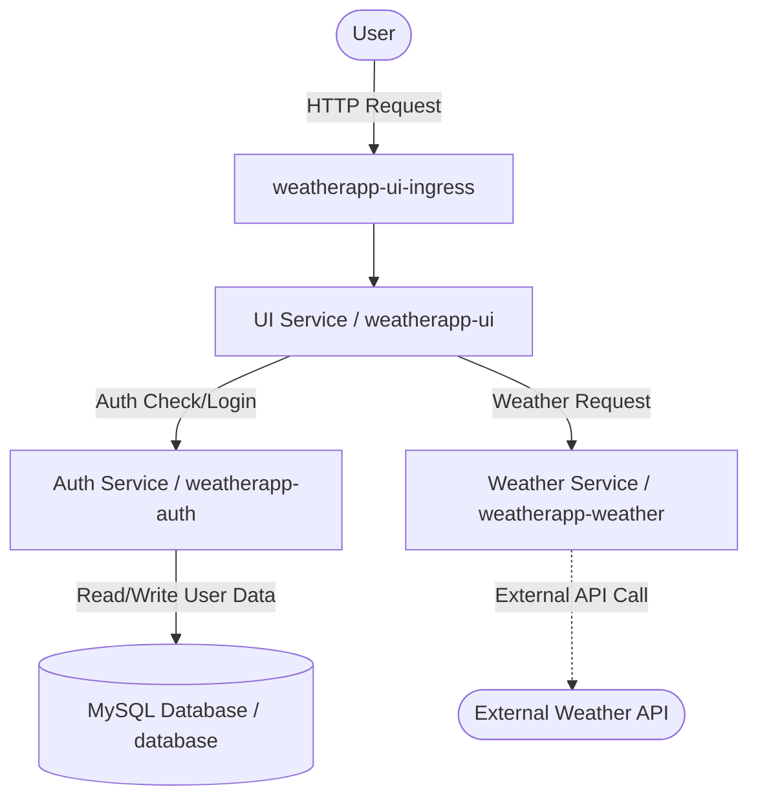

# Kubernetes Weather App

This is a microservices-based weather application designed to run on Kubernetes.

## Architecture Diagram

The application consists of the following microservices:
- **UI Service**: Serves the frontend interface and acts as the main entry point for the user. (Exposed via Ingress).
- **Auth Service**: Handles user authentication, registration, and session management.
- **Weather Service**: Fetches weather data using an external API based on user requests.
- **Database**: A MySQL database used by the Auth Service to store user credentials.

Here is a diagram showing how these services interact with one another:



## Microservices Breakdown

1. **weatherapp-ui** (`logx1/weatherapp-ui:v1`)
   - Replicas: 2
   - Port: 3000
   - Dependencies: `weatherapp-auth`, `weatherapp-weather`

2. **weatherapp-auth** (`logx1/weatherapp-auth:v1`)
   - Replicas: 2
   - Port: 8080
   - Dependencies: `database-svc` (MySQL)

3. **weatherapp-weather** (`logx1/weatherapp:v2`)
   - Replicas: 2
   - Port: 5000

4. **database** (`mysql:5.7`)
   - Replicas: 1 (StatefulSet)
   - Port: 3306
   - Persistent Storage: 10Gi

## Prerequisites

- A running Kubernetes cluster.
- `kubectl` configured to interact with your cluster.
- An Ingress controller (e.g., Traefik, which is assumed by the provided ingress).

## Installation

The project uses Kustomize to manage deployments. You can deploy the entire stack using `kubectl`:

```bash
# Apply the Kustomization from the root directory
kubectl apply -k .
```

This command will apply all manifests defined in `kustomization.yaml`, including Deployments, Services, HorizontalPodAutoscalers, StatefulSets, Jobs, and Ingresses for the application components.

### Secrets Configuration

Make sure you have populated the correct Secrets for the application to work:


- The **Weather Service** expects an API key to be available via a Secret named `weather` (key `apikey`).
- The **Auth Service** and **Database** expect passwords to be available via a Secret named `passwd`.
